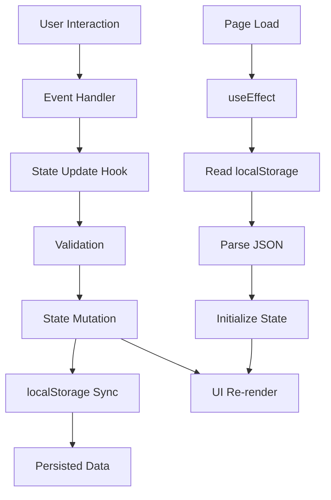
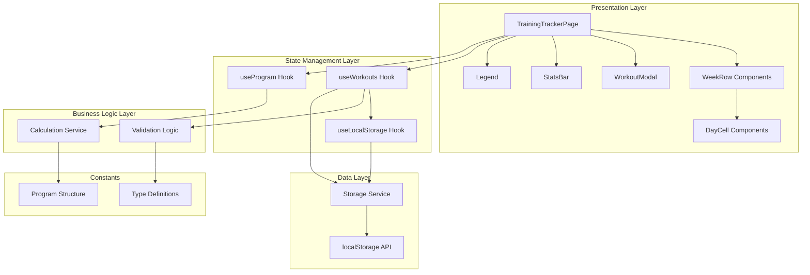
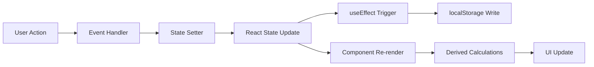

# Design Document: Training Tracker

## Overview

The Training Tracker is a client-side web application built with Next.js 16, React 19, TypeScript, and Ant Design. It provides an interactive calendar interface for tracking an 8-week cardiovascular training program combining Zone 2 cardio and HIIT workouts.

### Key Design Principles

1. **Client-Side First**: All data management and state handled in the browser using React hooks and localStorage
2. **Progressive Enhancement**: Core functionality works without server-side processing
3. **Responsive Design**: Mobile-first approach with desktop enhancements
4. **Immediate Feedback**: Real-time UI updates without page reloads
5. **Data Persistence**: Automatic saving to localStorage on every change

### Technology Stack

- **Framework**: Next.js 16.2.3 (App Router with client components)
- **UI Library**: React 19.2.4
- **Component Library**: Ant Design 6.3.5
- **Language**: TypeScript 5
- **Styling**: CSS Modules + Ant Design theming
- **State Management**: React hooks (useState, useEffect, useMemo)
- **Data Persistence**: Browser localStorage with JSON serialization

## Architecture

### Application Structure

```
src/app/training-tracker/
├── page.tsx                 # Main page component (client component)
├── styles.css              # Component-specific styles
├── components/
│   ├── WeekRow.tsx         # Individual week display component
│   ├── DayCell.tsx         # Individual day cell component
│   ├── WorkoutModal.tsx    # Modal for adding/editing workouts
│   ├── StatsBar.tsx        # Progress statistics display
│   └── Legend.tsx          # Color legend component
├── hooks/
│   ├── useWorkouts.ts      # Workout data management hook
│   ├── useProgram.ts       # Program structure and calculations hook
│   └── useLocalStorage.ts  # localStorage persistence hook
├── services/
│   ├── storage.ts          # localStorage abstraction layer
│   └── calculations.ts     # Progress calculation utilities
├── types/
│   └── index.ts            # TypeScript type definitions
└── constants/
    └── program.ts          # Program structure constants
```

### Component Hierarchy

```
TrainingTrackerPage (page.tsx)
├── Card (Ant Design)
│   ├── Header
│   │   ├── Title
│   │   └── Subtitle
│   ├── StatsBar
│   │   └── StatItem[] (5 items)
│   ├── Legend
│   │   └── LegendItem[] (3 items)
│   └── WeeksContainer
│       └── WeekRow[] (8 weeks)
│           ├── WeekHeader
│           │   ├── WeekInfo
│           │   └── WeekLabel (conditional)
│           ├── DaysContainer
│           │   └── DayCell[] (7 days)
│           └── WeekSummary
└── WorkoutModal (conditional)
    ├── Modal (Ant Design)
    ├── Form (Ant Design)
    │   ├── WorkoutTypeSelect
    │   ├── DurationInput
    │   └── ActionButtons
    └── DeleteButton (conditional)
```

### Data Flow



### System Architecture Diagram



## Components and Interfaces

### Core Components

#### 1. TrainingTrackerPage (page.tsx)

**Purpose**: Main container component that orchestrates the entire application

**Responsibilities**:
- Initialize and manage global application state
- Coordinate data flow between child components
- Handle modal visibility state
- Provide context for workout operations

**Props**: None (root page component)

**State**:
```typescript
- workouts: Map<string, Workout>  // Key: "week-day" format
- selectedDay: { week: number; day: number } | null
- isModalOpen: boolean
```

**Key Methods**:
- `handleDayClick(week: number, day: number): void`
- `handleWorkoutSave(workout: Workout): void`
- `handleWorkoutDelete(week: number, day: number): void`
- `handleModalClose(): void`

---

#### 2. WeekRow Component

**Purpose**: Display a single training week with all days and summary

**Props**:
```typescript
interface WeekRowProps {
  week: WeekData;
  workouts: Map<string, Workout>;
  isActive: boolean;
  onDayClick: (week: number, day: number) => void;
}
```

**Responsibilities**:
- Render week header with number, dates, and optional label
- Display 7 day cells with workout data
- Show week summary with totals and remaining targets
- Apply active week styling

---

#### 3. DayCell Component

**Purpose**: Display a single day with workout information

**Props**:
```typescript
interface DayCellProps {
  day: DayInfo;
  workout: Workout | undefined;
  isToday: boolean;
  onClick: () => void;
}
```

**Responsibilities**:
- Display day name (Mon, Tue, etc.)
- Show workout duration if present
- Apply color coding based on workout type
- Highlight today's date
- Handle click events for workout entry

**Visual States**:
- Empty: Default background
- Zone 2: Green background (#7cb342)
- HIIT: Orange background (#ff9800)
- Today: Blue border (#3498db)

---

#### 4. WorkoutModal Component

**Purpose**: Form interface for adding, editing, and deleting workouts

**Props**:
```typescript
interface WorkoutModalProps {
  open: boolean;
  workout: Workout | undefined;
  dayInfo: { week: number; day: number; dayName: string };
  onSave: (workout: Workout) => void;
  onDelete: () => void;
  onCancel: () => void;
}
```

**Form Fields**:
- Workout Type: Radio group (Zone 2 / HIIT)
- Duration: Number input (minutes, positive integers only)

**Validation Rules**:
- Duration is required
- Duration must be positive integer
- Duration must be > 0

**Actions**:
- Save: Validate and submit workout
- Delete: Remove existing workout (only shown when editing)
- Cancel: Close without changes

---

#### 5. StatsBar Component

**Purpose**: Display aggregate program statistics

**Props**:
```typescript
interface StatsBarProps {
  stats: ProgramStats;
}
```

**Displayed Metrics**:
1. Total Z2: Sum of all Zone 2 workout minutes
2. Target: Total program target (1630 minutes)
3. Weeks Done: Completed weeks / total weeks
4. HIIT Weeks: Weeks with HIIT / total weeks
5. Week: Current week number / 8

---

#### 6. Legend Component

**Purpose**: Display color coding reference

**Props**: None (static display)

**Items**:
- Zone 2: Green square
- HIIT: Orange square
- Today: Blue square

### Custom Hooks

#### useWorkouts Hook

**Purpose**: Manage workout data and localStorage synchronization

**Interface**:
```typescript
interface UseWorkoutsReturn {
  workouts: Map<string, Workout>;
  addWorkout: (week: number, day: number, workout: Workout) => void;
  updateWorkout: (week: number, day: number, workout: Workout) => void;
  deleteWorkout: (week: number, day: number) => void;
  getWorkout: (week: number, day: number) => Workout | undefined;
}

function useWorkouts(): UseWorkoutsReturn
```

**Implementation Details**:
- Uses Map for O(1) workout lookups
- Key format: `${week}-${day}` (e.g., "1-3" for week 1, day 3)
- Automatically syncs to localStorage on every mutation
- Initializes from localStorage on mount

---

#### useProgram Hook

**Purpose**: Calculate program statistics and week status

**Interface**:
```typescript
interface UseProgramReturn {
  stats: ProgramStats;
  getWeekStatus: (week: number) => WeekStatus;
  getWeekProgress: (week: number) => WeekProgress;
  getCurrentWeek: () => number;
}

function useProgram(workouts: Map<string, Workout>): UseProgramReturn
```

**Calculations**:
- Total Zone 2 minutes across all workouts
- Completed weeks (meets minimum target + has HIIT)
- HIIT weeks count
- Current week based on program start date
- Per-week totals and remaining minutes

---

#### useLocalStorage Hook

**Purpose**: Generic localStorage persistence with JSON serialization

**Interface**:
```typescript
function useLocalStorage<T>(
  key: string,
  initialValue: T
): [T, (value: T) => void]
```

**Features**:
- Type-safe serialization/deserialization
- Error handling for quota exceeded
- Automatic JSON parsing
- SSR-safe (checks for window object)

## Data Models

### Core Types

```typescript
// Workout type enumeration
type WorkoutType = 'zone2' | 'hiit';

// Individual workout entry
interface Workout {
  type: WorkoutType;
  duration: number; // minutes
  date: string; // ISO date string
}

// Day information for calendar display
interface DayInfo {
  day: string; // "Mon", "Tue", etc.
  dayNumber: number; // 0-6
  date: Date;
}

// Week structure with targets
interface WeekData {
  week: number; // 1-8
  startDate: Date;
  endDate: Date;
  targetMin: number; // minimum minutes
  targetMax: number; // maximum minutes
  label?: 'DELOAD' | 'TAPER';
  days: DayInfo[];
}

// Week progress calculations
interface WeekProgress {
  totalMinutes: number;
  zone2Minutes: number;
  hiitMinutes: number;
  hasHiit: boolean;
  meetsMinimum: boolean;
  isComplete: boolean;
  remainingMinutes: number;
}

// Week status for styling
type WeekStatus = 'active' | 'completed' | 'upcoming' | 'deload' | 'taper';

// Overall program statistics
interface ProgramStats {
  totalZone2Minutes: number;
  totalMinutes: number;
  targetMinutes: number; // 1630
  weeksCompleted: number;
  hiitWeeks: number;
  currentWeek: number;
}

// localStorage data structure
interface StoredData {
  version: number; // for future migrations
  workouts: Array<{
    week: number;
    day: number;
    workout: Workout;
  }>;
  programStartDate: string; // ISO date
}
```

### Program Constants

```typescript
// Program structure definition
const PROGRAM_STRUCTURE: WeekData[] = [
  { week: 1, targetMin: 180, targetMax: 210 },
  { week: 2, targetMin: 200, targetMax: 230 },
  { week: 3, targetMin: 220, targetMax: 260 },
  { week: 4, targetMin: 160, targetMax: 200, label: 'DELOAD' },
  { week: 5, targetMin: 230, targetMax: 270 },
  { week: 6, targetMin: 250, targetMax: 300 },
  { week: 7, targetMin: 240, targetMax: 280 },
  { week: 8, targetMin: 150, targetMax: 190, label: 'TAPER' },
];

const TOTAL_PROGRAM_TARGET = 1630; // minutes
const PROGRAM_START_DATE = '2026-02-18'; // Wed, Feb 18, 2026
const PROGRAM_END_DATE = '2026-04-14'; // Tue, Apr 14, 2026
const DAYS_OF_WEEK = ['Wed', 'Thu', 'Fri', 'Sat', 'Sun', 'Mon', 'Tue'];
```

### Data Validation

```typescript
// Workout validation
function validateWorkout(workout: Partial<Workout>): string[] {
  const errors: string[] = [];
  
  if (!workout.type) {
    errors.push('Workout type is required');
  }
  
  if (!workout.duration) {
    errors.push('Duration is required');
  } else if (workout.duration <= 0) {
    errors.push('Duration must be greater than 0');
  } else if (!Number.isInteger(workout.duration)) {
    errors.push('Duration must be a whole number');
  }
  
  return errors;
}
```

## State Management

### State Architecture

The application uses a **unidirectional data flow** pattern with React hooks:

1. **Single Source of Truth**: Workout data stored in a Map at the root component
2. **Derived State**: All statistics and progress calculated from workout data
3. **Local UI State**: Modal visibility and form state managed locally
4. **Persistence Layer**: Automatic sync to localStorage on state changes

### State Flow Diagram



### State Management Strategy

#### Root State (TrainingTrackerPage)

```typescript
const [workouts, setWorkouts] = useState<Map<string, Workout>>(new Map());
const [selectedDay, setSelectedDay] = useState<SelectedDay | null>(null);
const [isModalOpen, setIsModalOpen] = useState(false);
```

#### Derived State (useMemo)

```typescript
// Calculate once per render, only when workouts change
const programStats = useMemo(() => 
  calculateProgramStats(workouts), 
  [workouts]
);

const weekProgress = useMemo(() => 
  calculateWeekProgress(workouts, currentWeek),
  [workouts, currentWeek]
);
```

#### Side Effects (useEffect)

```typescript
// Sync to localStorage whenever workouts change
useEffect(() => {
  saveToLocalStorage('training-tracker-data', workouts);
}, [workouts]);

// Load from localStorage on mount
useEffect(() => {
  const stored = loadFromLocalStorage('training-tracker-data');
  if (stored) {
    setWorkouts(stored);
  }
}, []);
```

### State Update Patterns

#### Adding a Workout

```typescript
const handleWorkoutSave = (week: number, day: number, workout: Workout) => {
  setWorkouts(prev => {
    const next = new Map(prev);
    next.set(`${week}-${day}`, workout);
    return next;
  });
  setIsModalOpen(false);
};
```

#### Deleting a Workout

```typescript
const handleWorkoutDelete = (week: number, day: number) => {
  setWorkouts(prev => {
    const next = new Map(prev);
    next.delete(`${week}-${day}`);
    return next;
  });
  setIsModalOpen(false);
};
```

## Service Layer

### Storage Service

**Purpose**: Abstract localStorage operations with error handling

```typescript
// storage.ts

const STORAGE_KEY = 'training-tracker-v1';

export interface StorageService {
  save(data: StoredData): boolean;
  load(): StoredData | null;
  clear(): void;
}

export const storageService: StorageService = {
  save(data: StoredData): boolean {
    try {
      const serialized = JSON.stringify(data);
      localStorage.setItem(STORAGE_KEY, serialized);
      return true;
    } catch (error) {
      console.error('Failed to save to localStorage:', error);
      return false;
    }
  },

  load(): StoredData | null {
    try {
      const serialized = localStorage.getItem(STORAGE_KEY);
      if (!serialized) return null;
      return JSON.parse(serialized);
    } catch (error) {
      console.error('Failed to load from localStorage:', error);
      return null;
    }
  },

  clear(): void {
    localStorage.removeItem(STORAGE_KEY);
  }
};
```

### Calculation Service

**Purpose**: Pure functions for program calculations

```typescript
// calculations.ts

export function calculateProgramStats(
  workouts: Map<string, Workout>
): ProgramStats {
  let totalZone2Minutes = 0;
  let totalMinutes = 0;
  const hiitWeeks = new Set<number>();
  const completedWeeks = new Set<number>();

  // Aggregate workout data
  workouts.forEach((workout, key) => {
    const [week] = key.split('-').map(Number);
    totalMinutes += workout.duration;
    
    if (workout.type === 'zone2') {
      totalZone2Minutes += workout.duration;
    } else if (workout.type === 'hiit') {
      hiitWeeks.add(week);
    }
  });

  // Check completed weeks
  for (let week = 1; week <= 8; week++) {
    const progress = calculateWeekProgress(workouts, week);
    if (progress.isComplete) {
      completedWeeks.add(week);
    }
  }

  return {
    totalZone2Minutes,
    totalMinutes,
    targetMinutes: TOTAL_PROGRAM_TARGET,
    weeksCompleted: completedWeeks.size,
    hiitWeeks: hiitWeeks.size,
    currentWeek: getCurrentWeek(),
  };
}

export function calculateWeekProgress(
  workouts: Map<string, Workout>,
  week: number
): WeekProgress {
  let totalMinutes = 0;
  let zone2Minutes = 0;
  let hiitMinutes = 0;
  let hasHiit = false;

  // Sum workouts for this week
  for (let day = 0; day < 7; day++) {
    const workout = workouts.get(`${week}-${day}`);
    if (workout) {
      totalMinutes += workout.duration;
      if (workout.type === 'zone2') {
        zone2Minutes += workout.duration;
      } else {
        hiitMinutes += workout.duration;
        hasHiit = true;
      }
    }
  }

  const weekData = PROGRAM_STRUCTURE[week - 1];
  const meetsMinimum = totalMinutes >= weekData.targetMin;
  const isComplete = meetsMinimum && hasHiit;
  const remainingMinutes = Math.max(0, weekData.targetMin - totalMinutes);

  return {
    totalMinutes,
    zone2Minutes,
    hiitMinutes,
    hasHiit,
    meetsMinimum,
    isComplete,
    remainingMinutes,
  };
}

export function getCurrentWeek(): number {
  const now = new Date();
  const start = new Date(PROGRAM_START_DATE);
  const diffTime = now.getTime() - start.getTime();
  const diffDays = Math.floor(diffTime / (1000 * 60 * 60 * 24));
  const week = Math.floor(diffDays / 7) + 1;
  return Math.max(1, Math.min(8, week));
}

export function isToday(date: Date): boolean {
  const now = new Date();
  return (
    date.getDate() === now.getDate() &&
    date.getMonth() === now.getMonth() &&
    date.getFullYear() === now.getFullYear()
  );
}
```

## UI Component Specifications

### Design System

#### Color Palette

```typescript
const COLORS = {
  // Backgrounds
  primary: '#2c3e50',
  secondary: '#34495e',
  cardBg: 'rgba(44, 62, 80, 0.95)',
  weekBg: 'rgba(52, 73, 94, 0.4)',
  weekBgHover: 'rgba(52, 73, 94, 0.6)',
  dayBg: 'rgba(44, 62, 80, 0.6)',
  
  // Workout types
  zone2: '#7cb342',
  zone2Border: '#689f38',
  hiit: '#ff9800',
  hiitBorder: '#f57c00',
  
  // Status
  active: '#3498db',
  activeBg: 'rgba(52, 152, 219, 0.15)',
  today: '#3498db',
  todayBg: 'rgba(52, 152, 219, 0.2)',
  
  // Text
  textPrimary: '#ffffff',
  textSecondary: 'rgba(255, 255, 255, 0.7)',
  textTertiary: 'rgba(255, 255, 255, 0.5)',
  
  // Accents
  deload: '#f39c12',
  link: '#3498db',
};
```

#### Typography

```typescript
const TYPOGRAPHY = {
  h1: { size: '28px', weight: 600 },
  subtitle: { size: '14px', weight: 400 },
  statLabel: { size: '11px', weight: 500, transform: 'uppercase' },
  statValue: { size: '24px', weight: 600 },
  weekTitle: { size: '15px', weight: 600 },
  weekDates: { size: '12px', weight: 400 },
  dayName: { size: '12px', weight: 500 },
  dayValue: { size: '14px', weight: 600 },
  weekTotal: { size: '14px', weight: 600 },
  weekRemaining: { size: '12px', weight: 400 },
};
```

#### Spacing

```typescript
const SPACING = {
  xs: '4px',
  sm: '8px',
  md: '12px',
  lg: '16px',
  xl: '20px',
  xxl: '24px',
};
```

#### Border Radius

```typescript
const RADIUS = {
  sm: '8px',
  md: '12px',
  lg: '16px',
};
```

### Responsive Breakpoints

```typescript
const BREAKPOINTS = {
  mobile: '768px',
  tablet: '1024px',
  desktop: '1200px',
};
```

### Component Styling Guidelines

#### WeekRow Responsive Behavior

**Desktop (> 1024px)**:
- Horizontal layout: header | days | summary
- Fixed widths for header (140px) and summary (180px)
- Days container fills remaining space

**Tablet (768px - 1024px)**:
- Wrap layout: header + days on first row, summary on second row
- Days container takes full width

**Mobile (< 768px)**:
- Vertical stack: header, days, summary
- Reduced day cell size (50px)
- Full-width summary

#### DayCell Interaction States

```css
/* Default */
.day-cell {
  background: rgba(44, 62, 80, 0.6);
  border: 1px solid rgba(255, 255, 255, 0.1);
  cursor: pointer;
  transition: all 0.2s ease;
}

/* Hover */
.day-cell:hover {
  background: rgba(52, 73, 94, 0.8);
  border-color: rgba(255, 255, 255, 0.2);
}

/* Zone 2 */
.day-cell.zone2 {
  background: #7cb342;
  border-color: #689f38;
}

/* HIIT */
.day-cell.hiit {
  background: #ff9800;
  border-color: #f57c00;
}

/* Today */
.day-cell.today {
  border: 2px solid #3498db;
  background: rgba(52, 152, 219, 0.2);
}
```

### Ant Design Component Usage

#### Modal Configuration

```typescript
<Modal
  title={`Add Workout - Week ${week}, ${dayName}`}
  open={isModalOpen}
  onCancel={onCancel}
  footer={null}
  width={400}
>
  <Form
    layout="vertical"
    onFinish={handleSubmit}
    initialValues={initialValues}
  >
    {/* Form fields */}
  </Form>
</Modal>
```

#### Form Fields

```typescript
// Workout Type
<Form.Item
  label="Workout Type"
  name="type"
  rules={[{ required: true, message: 'Please select workout type' }]}
>
  <Radio.Group>
    <Radio value="zone2">Zone 2</Radio>
    <Radio value="hiit">HIIT</Radio>
  </Radio.Group>
</Form.Item>

// Duration
<Form.Item
  label="Duration (minutes)"
  name="duration"
  rules={[
    { required: true, message: 'Please enter duration' },
    { type: 'number', min: 1, message: 'Duration must be at least 1 minute' }
  ]}
>
  <InputNumber
    min={1}
    style={{ width: '100%' }}
    placeholder="Enter minutes"
  />
</Form.Item>
```

## Error Handling

### Error Categories

1. **Storage Errors**: localStorage quota exceeded, access denied
2. **Validation Errors**: Invalid workout data
3. **Parse Errors**: Corrupted localStorage data
4. **Date Errors**: Invalid date calculations

### Error Handling Strategy

```typescript
// Storage error handling
try {
  localStorage.setItem(key, value);
} catch (error) {
  if (error.name === 'QuotaExceededError') {
    // Show user message: "Storage full, please clear old data"
    console.error('localStorage quota exceeded');
  } else {
    // Show user message: "Failed to save data"
    console.error('localStorage error:', error);
  }
}

// Validation error handling
const errors = validateWorkout(workout);
if (errors.length > 0) {
  // Display errors in form
  message.error(errors.join(', '));
  return;
}

// Parse error handling
try {
  const data = JSON.parse(stored);
  return data;
} catch (error) {
  console.error('Failed to parse stored data:', error);
  // Clear corrupted data
  localStorage.removeItem(key);
  return null;
}
```

### User Feedback

```typescript
// Success messages
message.success('Workout saved successfully');
message.success('Workout deleted');

// Error messages
message.error('Failed to save workout');
message.error('Please enter a valid duration');

// Warning messages
message.warning('Storage is almost full');
```

## Testing Strategy

### Testing Approach

The Training Tracker uses a **dual testing approach**:

1. **Unit Tests**: Verify specific examples, edge cases, and error conditions
2. **Property-Based Tests**: Verify universal properties across all inputs

### Unit Testing

**Focus Areas**:
- Calculation functions with specific examples
- Component rendering with known data
- Edge cases (empty data, boundary values)
- Error handling paths
- localStorage operations

**Example Unit Tests**:

```typescript
describe('calculateWeekProgress', () => {
  it('should return zero progress for empty week', () => {
    const workouts = new Map();
    const progress = calculateWeekProgress(workouts, 1);
    expect(progress.totalMinutes).toBe(0);
    expect(progress.isComplete).toBe(false);
  });

  it('should mark week complete when target met with HIIT', () => {
    const workouts = new Map([
      ['1-0', { type: 'zone2', duration: 150, date: '2026-02-18' }],
      ['1-1', { type: 'hiit', duration: 40, date: '2026-02-19' }],
    ]);
    const progress = calculateWeekProgress(workouts, 1);
    expect(progress.totalMinutes).toBe(190);
    expect(progress.isComplete).toBe(true);
  });

  it('should not mark week complete without HIIT', () => {
    const workouts = new Map([
      ['1-0', { type: 'zone2', duration: 200, date: '2026-02-18' }],
    ]);
    const progress = calculateWeekProgress(workouts, 1);
    expect(progress.meetsMinimum).toBe(true);
    expect(progress.isComplete).toBe(false);
  });
});
```

### Property-Based Testing

**Assessment**: Property-based testing IS appropriate for this feature because:
- Core calculation logic is pure functions with clear input/output
- Universal properties exist (invariants, aggregations, validations)
- Input space is large (various workout combinations, durations, weeks)
- Testing parsers (JSON serialization), data transformations, and business logic

**Library**: fast-check (TypeScript property-based testing library)

**Configuration**: Minimum 100 iterations per property test


## Correctness Properties

*A property is a characteristic or behavior that should hold true across all valid executions of a system—essentially, a formal statement about what the system should do. Properties serve as the bridge between human-readable specifications and machine-verifiable correctness guarantees.*

### Property Reflection

After analyzing all acceptance criteria, I identified the following properties and eliminated redundancy:

**Redundancies Eliminated**:
- Requirements 7.1 and 7.2 duplicate 1.2 and 2.3 (persistence operations)
- Requirements 7.4 duplicates 7.3 (UI restoration is implied by data restoration)
- Requirements 3.1 and 3.2 can be combined into a single color mapping property
- Requirements 4.1 and 4.2 can be combined into a single aggregation property
- Multiple calculation properties (4.4, 6.1, 6.3, 6.4) can be verified through a comprehensive calculation correctness property

### Core Properties

#### Property 1: Workout Persistence Round-Trip

*For any* valid workout with type and duration, saving the workout to a specific week and day, then loading the application data, should retrieve an equivalent workout at the same week and day position.

**Validates: Requirements 1.2, 1.3, 7.1, 7.3**

---

#### Property 2: Workout Update Preservation

*For any* existing workout at a specific week and day, updating it with new valid workout data should result in the updated workout being retrievable at the same position with the new values.

**Validates: Requirements 2.2**

---

#### Property 3: Workout Deletion Removal

*For any* workout at a specific week and day, deleting the workout should result in no workout being retrievable at that position.

**Validates: Requirements 2.3, 7.2**

---

#### Property 4: Cancel Operation Invariant

*For any* program state with workout data, opening the workout modal and canceling without saving should result in the program state remaining unchanged.

**Validates: Requirements 2.5**

---

#### Property 5: Workout Type Color Mapping

*For any* workout, the rendered day cell background color should be green (#7cb342) if the workout type is Zone 2, and orange (#ff9800) if the workout type is HIIT.

**Validates: Requirements 3.1, 3.2**

---

#### Property 6: Duration Display Consistency

*For any* workout with a duration value, the rendered day cell should display that exact duration value in minutes.

**Validates: Requirements 3.4**

---

#### Property 7: Weekly Total Aggregation

*For any* set of workouts within a single training week, the calculated weekly total should equal the sum of all workout durations regardless of workout type.

**Validates: Requirements 4.1, 4.2**

---

#### Property 8: Remaining Minutes Calculation

*For any* training week with a total below the minimum target, the calculated remaining minutes should equal the minimum target minus the current total, and should be zero or negative when the total meets or exceeds the minimum target.

**Validates: Requirements 4.4**

---

#### Property 9: HIIT Requirement Indicator

*For any* training week that contains only Zone 2 workouts (no HIIT workouts) and has not met the completion criteria, the week status should indicate "need HIIT".

**Validates: Requirements 4.5**

---

#### Property 10: Week Completion Criteria

*For any* training week, the week should be marked as complete if and only if the total minutes meet or exceed the minimum target AND the week contains at least one HIIT workout.

**Validates: Requirements 4.6**

---

#### Property 11: Zone 2 Total Aggregation

*For any* set of workouts across all weeks, the total Zone 2 minutes should equal the sum of durations for all workouts where type is Zone 2.

**Validates: Requirements 6.1**

---

#### Property 12: Completed Weeks Count

*For any* program state, the count of completed weeks should equal the number of weeks (1-8) that meet the completion criteria (minimum target met with at least one HIIT workout).

**Validates: Requirements 6.3**

---

#### Property 13: HIIT Weeks Count

*For any* program state, the count of HIIT weeks should equal the number of distinct weeks (1-8) that contain at least one HIIT workout.

**Validates: Requirements 6.4**

---

#### Property 14: Statistics Reactivity

*For any* program state, adding or removing a workout should result in recalculated statistics that accurately reflect the new state (total minutes, completed weeks, HIIT weeks).

**Validates: Requirements 6.6**

---

#### Property 15: JSON Serialization Round-Trip

*For any* valid workout data structure, serializing to JSON then deserializing should produce an equivalent data structure with all workout information preserved.

**Validates: Requirements 7.5**

---

#### Property 16: Input Validation Consistency

*For any* workout duration input, the validation should accept positive integers and reject zero, negative numbers, and non-integer values.

**Validates: Requirements 1.5**

---

#### Property 17: Weekly Progress Display Completeness

*For any* training week with workouts, the displayed progress information should include both the current total minutes and the target range (minimum-maximum).

**Validates: Requirements 4.3**

### Property Testing Implementation

**Library**: fast-check (npm package for property-based testing in TypeScript)

**Configuration**:
- Minimum 100 iterations per property test
- Each test tagged with: `Feature: training-tracker, Property {number}: {property_text}`

**Generator Strategy**:

```typescript
// Workout generator
const workoutArb = fc.record({
  type: fc.constantFrom('zone2', 'hiit'),
  duration: fc.integer({ min: 1, max: 300 }),
  date: fc.date({ min: new Date('2026-02-18'), max: new Date('2026-04-14') })
    .map(d => d.toISOString())
});

// Week/day position generator
const positionArb = fc.record({
  week: fc.integer({ min: 1, max: 8 }),
  day: fc.integer({ min: 0, max: 6 })
});

// Workout map generator
const workoutMapArb = fc.array(
  fc.tuple(positionArb, workoutArb),
  { maxLength: 56 } // 8 weeks * 7 days
).map(entries => {
  const map = new Map();
  entries.forEach(([pos, workout]) => {
    map.set(`${pos.week}-${pos.day}`, workout);
  });
  return map;
});
```

**Example Property Test**:

```typescript
import fc from 'fast-check';

// Feature: training-tracker, Property 1: Workout Persistence Round-Trip
describe('Property 1: Workout Persistence Round-Trip', () => {
  it('should preserve workout data through save and load cycle', () => {
    fc.assert(
      fc.property(
        workoutArb,
        positionArb,
        (workout, position) => {
          // Save workout
          const workouts = new Map();
          workouts.set(`${position.week}-${position.day}`, workout);
          
          // Serialize to localStorage format
          const stored = storageService.save(serializeWorkouts(workouts));
          
          // Load back
          const loaded = storageService.load();
          const deserializedWorkouts = deserializeWorkouts(loaded);
          
          // Verify equivalence
          const retrievedWorkout = deserializedWorkouts.get(
            `${position.week}-${position.day}`
          );
          
          expect(retrievedWorkout).toEqual(workout);
        }
      ),
      { numRuns: 100 }
    );
  });
});
```


## Implementation Approach

### Development Phases

#### Phase 1: Foundation (Core Data Layer)

**Objective**: Establish data models, storage, and calculation logic

**Tasks**:
1. Define TypeScript types and interfaces
2. Implement storage service with localStorage abstraction
3. Implement calculation service (pure functions)
4. Create program constants
5. Write unit tests for calculations
6. Set up property-based testing infrastructure

**Deliverables**:
- `types/index.ts` - Complete type definitions
- `services/storage.ts` - Storage service with error handling
- `services/calculations.ts` - All calculation functions
- `constants/program.ts` - Program structure constants
- Test suite for calculation logic

---

#### Phase 2: State Management (Hooks Layer)

**Objective**: Build React hooks for state management

**Tasks**:
1. Implement `useLocalStorage` hook
2. Implement `useWorkouts` hook with CRUD operations
3. Implement `useProgram` hook with derived calculations
4. Write unit tests for hooks
5. Write property tests for state operations

**Deliverables**:
- `hooks/useLocalStorage.ts`
- `hooks/useWorkouts.ts`
- `hooks/useProgram.ts`
- Test suite for hooks

---

#### Phase 3: UI Components (Presentation Layer)

**Objective**: Build reusable UI components

**Tasks**:
1. Create `DayCell` component with styling
2. Create `WeekRow` component
3. Create `StatsBar` component
4. Create `Legend` component
5. Create `WorkoutModal` component with form validation
6. Write component unit tests
7. Implement responsive styles

**Deliverables**:
- `components/DayCell.tsx`
- `components/WeekRow.tsx`
- `components/StatsBar.tsx`
- `components/Legend.tsx`
- `components/WorkoutModal.tsx`
- Component test suite

---

#### Phase 4: Integration (Main Page)

**Objective**: Integrate all components into main page

**Tasks**:
1. Create main page component
2. Wire up state management
3. Implement event handlers
4. Add error boundaries
5. Implement loading states
6. Write integration tests
7. Test responsive behavior

**Deliverables**:
- `page.tsx` - Main page component
- `styles.css` - Page styles
- Integration test suite

---

#### Phase 5: Property-Based Testing

**Objective**: Implement comprehensive property tests

**Tasks**:
1. Set up fast-check library
2. Create property test generators
3. Implement all 17 property tests
4. Run property tests with 100+ iterations
5. Fix any discovered edge cases
6. Document property test results

**Deliverables**:
- Property test suite (17 tests)
- Generator utilities
- Property test documentation

---

#### Phase 6: Polish and Optimization

**Objective**: Refine UX and performance

**Tasks**:
1. Add loading indicators
2. Implement optimistic UI updates
3. Add keyboard navigation
4. Improve accessibility (ARIA labels)
5. Optimize re-renders with React.memo
6. Add error messages and user feedback
7. Cross-browser testing
8. Mobile device testing

**Deliverables**:
- Polished UI with smooth interactions
- Accessibility improvements
- Performance optimizations
- Cross-browser compatibility

### File Structure

```
src/app/training-tracker/
├── page.tsx                          # Main page component (350 lines)
├── styles.css                        # Component styles (400 lines)
│
├── components/
│   ├── DayCell.tsx                   # Day cell component (80 lines)
│   ├── WeekRow.tsx                   # Week row component (120 lines)
│   ├── WorkoutModal.tsx              # Workout modal (150 lines)
│   ├── StatsBar.tsx                  # Stats bar component (80 lines)
│   └── Legend.tsx                    # Legend component (40 lines)
│
├── hooks/
│   ├── useWorkouts.ts                # Workout CRUD hook (120 lines)
│   ├── useProgram.ts                 # Program calculations hook (100 lines)
│   └── useLocalStorage.ts            # localStorage hook (60 lines)
│
├── services/
│   ├── storage.ts                    # Storage abstraction (80 lines)
│   └── calculations.ts               # Calculation utilities (200 lines)
│
├── types/
│   └── index.ts                      # Type definitions (100 lines)
│
├── constants/
│   └── program.ts                    # Program constants (50 lines)
│
└── __tests__/
    ├── calculations.test.ts          # Unit tests (300 lines)
    ├── hooks.test.ts                 # Hook tests (250 lines)
    ├── components.test.ts            # Component tests (400 lines)
    └── properties.test.ts            # Property tests (600 lines)
```

**Total Estimated Lines**: ~3,480 lines

### Key Implementation Decisions

#### 1. Client-Side Only Architecture

**Decision**: Implement as a pure client-side application without server-side API

**Rationale**:
- Requirements specify localStorage persistence
- No multi-user or sync requirements
- Simpler deployment and maintenance
- Faster development cycle
- No backend infrastructure needed

**Trade-offs**:
- Data not accessible across devices
- No cloud backup
- Limited to single browser/device

---

#### 2. Map-Based Workout Storage

**Decision**: Use `Map<string, Workout>` with composite keys

**Rationale**:
- O(1) lookup performance
- Natural key structure: `${week}-${day}`
- Easy to serialize to/from JSON
- Efficient for sparse data (not all days have workouts)

**Alternative Considered**: Nested array structure `Workout[8][7]`
- Rejected due to memory waste for empty days
- More complex serialization

---

#### 3. Derived State with useMemo

**Decision**: Calculate statistics on-demand using useMemo

**Rationale**:
- Single source of truth (workout data)
- Automatic recalculation on data changes
- No risk of stale derived state
- Simpler state management

**Alternative Considered**: Store statistics in state
- Rejected due to synchronization complexity
- Risk of inconsistent state

---

#### 4. Ant Design for UI Components

**Decision**: Use Ant Design for Modal, Form, and Input components

**Rationale**:
- Already in project dependencies
- Consistent with existing UI (puls-kiro)
- Built-in form validation
- Accessible components
- Professional appearance

**Custom Components**: DayCell, WeekRow, StatsBar
- Highly specific to this application
- Custom styling requirements
- Performance optimization needs

---

#### 5. CSS Modules vs Styled Components

**Decision**: Use plain CSS with class names (following puls-kiro pattern)

**Rationale**:
- Consistent with existing codebase
- Simpler for responsive design
- Better performance (no runtime CSS-in-JS)
- Easier to maintain media queries

---

#### 6. Property-Based Testing with fast-check

**Decision**: Use fast-check for property-based testing

**Rationale**:
- Native TypeScript support
- Excellent generator library
- Shrinking support for minimal failing examples
- Active maintenance and community

**Alternative Considered**: jsverify
- Rejected due to less active maintenance
- Weaker TypeScript support

### Data Migration Strategy

**Version 1 Schema**:
```typescript
interface StoredDataV1 {
  version: 1;
  programStartDate: string;
  workouts: Array<{
    week: number;
    day: number;
    workout: Workout;
  }>;
}
```

**Future Migration Path**:
```typescript
function migrateStorage(stored: any): StoredData {
  if (!stored.version) {
    // Migrate from unversioned to v1
    return migrateToV1(stored);
  }
  
  if (stored.version === 1) {
    return stored;
  }
  
  // Future versions
  throw new Error(`Unsupported version: ${stored.version}`);
}
```

### Performance Considerations

#### Optimization Strategies

1. **Memoization**:
   - Use `useMemo` for expensive calculations
   - Memoize week progress calculations
   - Memoize program statistics

2. **Component Optimization**:
   - Wrap `DayCell` in `React.memo` (rendered 56 times)
   - Wrap `WeekRow` in `React.memo` (rendered 8 times)
   - Prevent unnecessary re-renders

3. **Event Handler Optimization**:
   - Use `useCallback` for event handlers passed to children
   - Prevent handler recreation on every render

4. **Lazy Calculation**:
   - Only calculate visible week progress
   - Defer non-critical calculations

**Performance Targets**:
- Initial render: < 100ms
- Workout save: < 50ms
- UI update after save: < 16ms (60fps)
- localStorage write: < 10ms

### Accessibility Requirements

1. **Keyboard Navigation**:
   - Tab through day cells
   - Enter to open workout modal
   - Escape to close modal
   - Arrow keys for week navigation

2. **Screen Reader Support**:
   - ARIA labels for day cells
   - ARIA live regions for statistics updates
   - Semantic HTML structure
   - Form field labels

3. **Visual Accessibility**:
   - Sufficient color contrast (WCAG AA)
   - Focus indicators on interactive elements
   - Text alternatives for color coding
   - Responsive text sizing

4. **Touch Targets**:
   - Minimum 44x44px touch targets on mobile
   - Adequate spacing between interactive elements

### Browser Compatibility

**Target Browsers**:
- Chrome 90+ (primary)
- Firefox 88+
- Safari 14+
- Edge 90+

**Required Features**:
- localStorage API
- ES6+ JavaScript
- CSS Grid and Flexbox
- CSS Custom Properties

**Polyfills**: None required (modern browsers only)

### Security Considerations

1. **XSS Prevention**:
   - React automatically escapes rendered content
   - No `dangerouslySetInnerHTML` usage
   - Validate all user input

2. **Data Validation**:
   - Validate workout data before storage
   - Sanitize localStorage data on load
   - Handle corrupted data gracefully

3. **localStorage Limits**:
   - Monitor storage usage
   - Warn user when approaching quota
   - Provide data export option

### Deployment

**Build Process**:
```bash
npm run build
```

**Output**: Static Next.js build in `.next/` directory

**Hosting Options**:
- Vercel (recommended for Next.js)
- Netlify
- Any static hosting service

**Environment Variables**: None required (client-side only)

**Route**: `/training-tracker`

### Future Enhancements

**Potential Features** (not in current scope):

1. **Data Export/Import**:
   - Export workouts to JSON/CSV
   - Import from other tracking apps
   - Backup/restore functionality

2. **Analytics Dashboard**:
   - Weekly trends chart
   - Zone 2 vs HIIT distribution
   - Progress over time visualization

3. **Notifications**:
   - Browser notifications for workout reminders
   - Weekly goal reminders
   - Completion celebrations

4. **Multi-Program Support**:
   - Create custom training programs
   - Switch between programs
   - Program templates

5. **Cloud Sync**:
   - Optional cloud backup
   - Multi-device sync
   - User accounts

6. **Social Features**:
   - Share progress
   - Compare with friends
   - Community challenges

## Conclusion

This design provides a comprehensive blueprint for implementing the Training Tracker application. The architecture emphasizes:

- **Simplicity**: Client-side only, no backend complexity
- **Correctness**: Property-based testing ensures robust behavior
- **Maintainability**: Clear separation of concerns, pure functions
- **User Experience**: Responsive design, immediate feedback, intuitive interface
- **Performance**: Optimized rendering, efficient calculations

The implementation follows React best practices, leverages TypeScript for type safety, and uses property-based testing to verify correctness across a wide range of inputs. The modular architecture allows for easy testing, maintenance, and future enhancements.
